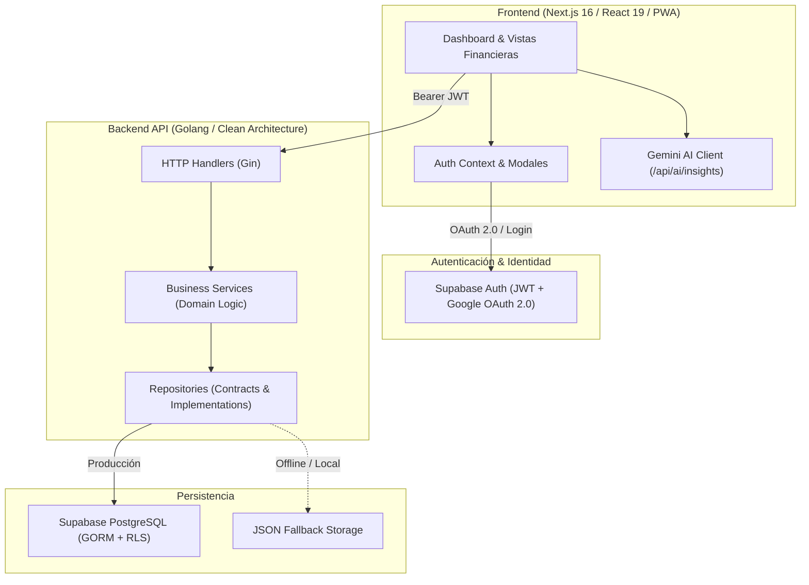

# FinTrack 🚀

[](https://go.dev/)
[](https://nextjs.org/)
[](https://react.dev/)
[](https://tailwindcss.com/)
[](https://supabase.com/)
[](https://ai.google.dev/)
[](./docs/SOLID_PRINCIPLES.md)

**FinTrack** es una plataforma integral para la gestión y análisis de finanzas personales, diseñada con un estándar riguroso de ingeniería de software. Cuenta con una arquitectura desacoplada en el backend en **Go** basada en principios **SOLID** y **Clean Architecture**, un frontend moderno en **Next.js 16** con **Tailwind CSS v4**, autenticación segura multi-proveedor (Email, Google OAuth 2.0 y recuperación de contraseñas), persistencia en **PostgreSQL** con aislamiento multi-inquilino (*Multi-tenancy*), y un motor inteligente de asesoría financiera impulsado por **Google Gemini AI**.

---

## 🌐 Enlaces en Vivo

* 🚀 **Frontend en Producción**: [https://fintrack-six-opal.vercel.app](https://fintrack-six-opal.vercel.app)
* ⚡ **Backend API en Producción**: [https://fintrack-ihwb.onrender.com/health](https://fintrack-ihwb.onrender.com/health)
* 📦 **Repositorio GitHub**: [https://github.com/TonyBrTs/Fintrack](https://github.com/TonyBrTs/Fintrack)

---

## 🏛️ Arquitectura del Sistema



---

## 🛡️ Principios SOLID Implementados

El backend de FinTrack fue refactorizado para cumplir rigurosamente con los principios **SOLID**:

| Principio | Aplicación en FinTrack |
| :--- | :--- |
| **S - Single Responsibility** | Separación estricta en 4 capas: Handlers (solo HTTP), Services (solo lógica financiera), Repositories (solo persistencia) y Models (solo estructuras de datos). |
| **O - Open/Closed** | El sistema es extensible a nuevas bases de datos (Redis, MongoDB, DynamoDB) implementando las interfaces de `internal/repository` sin tocar código existente. |
| **L - Liskov Substitution** | `GormExpenseRepository` y `MemoryExpenseRepository` son 100% intercambiables; los servicios operan idénticamente con cualquiera. |
| **I - Interface Segregation** | Interfaces granulares y segregadas (`ExpenseRepository`, `IncomeRepository`, `GoalRepository`, `CategoryRepository`) en lugar de interfaces gigantes. |
| **D - Dependency Inversion** | Los Handlers dependen de interfaces de Services; los Services dependen de interfaces de Repositories. Inyección limpia de dependencias en `main.go`. |

> 📖 Consulta el análisis completo con código y pruebas en [docs/SOLID_PRINCIPLES.md](./docs/SOLID_PRINCIPLES.md).

---

## ✨ Funcionalidades Principales

* 📊 **Dashboard Financiero en Tiempo Real**: Balance consolidado, ingresos, egresos, tasa de ahorro neta y gráficos analíticos interactivos.
* 🤖 **AI Financial Insights con Google Gemini**: Recomendaciones predictivas sobre hábitos de gasto con sistema de fallback en cascada y caché en memoria.
* 🔐 **Autenticación Integral**:
  * Inicio de sesión con correo y contraseña.
  * **"Continuar con Google"** (Google OAuth 2.0).
  * **"¿Olvidaste tu contraseña?"**: Flujo automatizado de recuperación por correo y restablecimiento seguro.
* 🏷️ **Categorías Personalizadas y Protección de Integridad**:
  * Categorías del sistema + categorías dinámicas por usuario con selector de colores e íconos Lucide.
  * Protección referencial: si una categoría tiene movimientos asociados, la API requiere reasignación antes de permitir eliminarla.
* 🎯 **Gestión de Metas de Ahorro**: Seguimiento de objetivos financieros con aportes en tiempo real y barras de progreso.
* 💱 **Soporte Multimoneda Dinámico**: Dólar estadounidense (**USD**), Euro (**EUR**), Libra esterlina (**GBP**) y Colón costarricense (**CRC**).
* 🌍 **Internacionalización Bilingüe (i18n)**: Soporte completo e instantáneo en **Español** e **Inglés**.
* 📱 **PWA (Progressive Web App)**: Instalable en dispositivos móviles y de escritorio con service worker offline.

---

## 📚 Documentación Técnica Detallada

Toda la arquitectura, base de datos, APIs y seguridad están documentadas a profundidad en la carpeta [`docs/`](./docs/):

| Documento | Descripción |
| :--- | :--- |
| 🏛️ [**docs/ARCHITECTURE.md**](./docs/ARCHITECTURE.md) | Clean Architecture, diagramas C4 de contenedores, flujo de datos y multi-tenancy. |
| 🛡️ [**docs/SOLID_PRINCIPLES.md**](./docs/SOLID_PRINCIPLES.md) | Detalle exhaustivo de los 5 principios SOLID con ejemplos antes/después y tests. |
| 📡 [**docs/API_REFERENCE.md**](./docs/API_REFERENCE.md) | Catálogo completo de endpoints REST, headers de autorización, payloads y códigos de error. |
| 🗄️ [**docs/DATABASE.md**](./docs/DATABASE.md) | Diagrama ERD, esquemas SQL de PostgreSQL, tipos de datos, índices y políticas RLS. |
| 🔐 [**docs/AUTH_AND_SECURITY.md**](./docs/AUTH_AND_SECURITY.md) | Flujos de OAuth 2.0, validación de JWT Bearer en Go, recuperación de contraseñas y CORS. |
| 🤖 [**docs/AI_INSIGHTS.md**](./docs/AI_INSIGHTS.md) | Integración con Google Gemini (2.0/1.5 Flash), prompt engineering y caché en memoria. |
| 🚀 [**docs/DEPLOYMENT.md**](./docs/DEPLOYMENT.md) | Guía de despliegue paso a paso en Vercel, Render y Supabase con matriz de variables. |

---

## 🚀 Inicio Rápido en Local

### Requisitos Previos:
- [Node.js](https://nodejs.org/) v20 o superior
- [Go](https://go.dev/) v1.22 o superior

### 1. Clonar el repositorio
```bash
git clone https://github.com/TonyBrTs/Fintrack.git
cd Fintrack
```

### 2. Ejecutar el Backend en Go
```bash
cd backend
go run main.go
```
*El servidor arrancará en `http://localhost:8080` (utilizará almacenamiento local JSON si no detecta PostgreSQL).*

### 3. Ejecutar el Frontend en Next.js
En otra terminal:
```bash
cd frontend
npm install
npm run dev
```
*Abre [http://localhost:3000](http://localhost:3000) en tu navegador.*

### 4. Ejecutar Pruebas Unitarias del Backend
```bash
cd backend
go test -v ./internal/services/...
```

---

## 📂 Estructura del Repositorio

```
Fintrack/
├── backend/                        # Backend REST API en Golang
│   ├── internal/
│   │   ├── database/               # Conexión PostgreSQL (GORM) y AutoMigrate
│   │   ├── handlers/               # Controladores HTTP (Gin Framework)
│   │   ├── middleware/             # Auth JWT Supabase y CORS
│   │   ├── models/                 # Entidades del dominio
│   │   ├── repository/             # Interfaces abstractas de persistencia
│   │   │   ├── gorm_repo/          # Implementación PostgreSQL / GORM
│   │   │   └── memory_repo/        # Implementación Local / Fallback JSON
│   │   └── services/               # Reglas de negocio y pruebas unitarias
│   ├── main.go                     # Bootstrap e Inyección de Dependencias
│   └── go.mod
│
├── frontend/                       # Frontend Next.js 16 (React 19)
│   ├── public/                     # PWA manifest, iconos y Service Worker
│   └── src/
│       ├── app/                    # Next.js App Router (Rutas y AI API)
│       ├── components/             # Componentes UI organizados por dominio
│       ├── contexts/               # Contextos globales (Auth, Currency, Language)
│       ├── hooks/                  # Custom React Hooks
│       ├── lib/                    # Clientes API, Supabase e i18n
│       └── types/                  # Tipado TypeScript compartido
│
├── docs/                           # Documentación Técnica Integral
│   ├── ARCHITECTURE.md
│   ├── SOLID_PRINCIPLES.md
│   ├── API_REFERENCE.md
│   ├── DATABASE.md
│   ├── AUTH_AND_SECURITY.md
│   ├── AI_INSIGHTS.md
│   └── DEPLOYMENT.md
│
└── README.md                       # Documentación principal del proyecto
```

---

## 👨‍💻 Autor

Desarrollado por **TonyBrTs**  
*Repositorio oficial*: [https://github.com/TonyBrTs/Fintrack](https://github.com/TonyBrTs/Fintrack)
