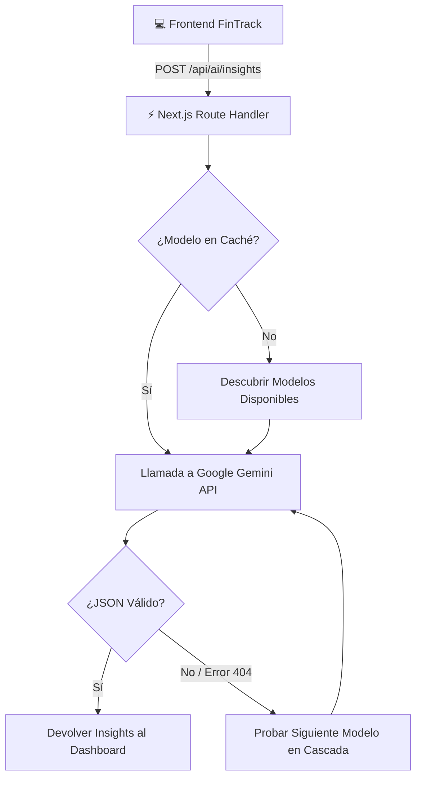

# 🤖 Motor de Inteligencia Artificial Financiera (Google Gemini) - FinTrack

FinTrack integra un sistema de análisis predictivo y asesoría financiera personalizada impulsado por los modelos de lenguaje de última generación de **Google Gemini**.

---

## 🏗️ 1. Arquitectura del Servicio de Insights

El análisis no sobrecarga el backend en Go; se ejecuta como una **Route Handler Serverless** en Next.js (`frontend/src/app/api/ai/insights/route.ts`), permitiendo ejecución escalable en el edge de Vercel.



---

## 🧠 2. Cascada Resiliente de Modelos y Descubrimiento Dinámico

Las claves de API de Google AI pueden variar en disponibilidad de modelos según la región y versión del endpoint (`v1beta`). Para evitar errores `404 NOT_FOUND` o interrupciones del servicio, FinTrack implementa:

1. **Descubrimiento Dinámico (`ModelService.ListModels`)**:  
   Consulta automáticamente a Google qué modelos con soporte `generateContent` están activos para la clave de API suministrada.
2. **Lista de Respaldo Ordenada por Rendimiento**:
   ```typescript
   const fallbackList = [
     "gemini-2.0-flash",
     "gemini-1.5-flash-latest",
     "gemini-1.5-flash",
     "gemini-2.5-flash",
     "gemini-1.5-pro",
     "gemini-pro",
   ];
   ```
3. **Caché en Memoria (`cachedWorkingModel`)**:  
   Una vez que un modelo responde exitosamente, se almacena en memoria para que las solicitudes posteriores no pierdan tiempo en sondeos ni descubrimientos, reduciendo la latencia de respuesta a menos de 1 segundo.

---

## 📝 3. Prompt Engineering y Salida Estructurada

El prompt está optimizado para actuar como un asesor financiero certificado, exigiendo respuestas estrictamente en formato **JSON** sin markdown accesorio:

```typescript
const prompt = `Actúa como un asesor financiero certificado y analiza estos datos financieros:
- Moneda activa: ${currency}
- Total Ingresos: ${totalIncome}
- Total Gastos: ${totalExpenses}
- Tasa de Ahorro: ${savingsRate}%
- Desglose por categorías y metas activas.

Genera de 3 a 5 recomendaciones accionables en formato JSON válido:
[
  {
    "id": "string",
    "type": "tip" | "warning" | "achievement" | "opportunity",
    "title": "string",
    "description": "string",
    "category": "string",
    "priority": "high" | "medium" | "low"
  }
]`;
```

---

## 🛡️ 4. Sanatización y Fallback Heurístico Local

Si por alguna razón la cuota de la API de Google se agota o se pierde la conexión a internet, el frontend no se rompe:
* Se extrae el JSON eliminando bloques markdown ` ```json ` si el modelo los añade.
* Si la llamada remota falla por completo, el componente `FinancialInsights.tsx` activa un motor heurístico local que calcula alertas de presupuesto, tasa de ahorro y progreso de metas sin requerir conexión externa.
