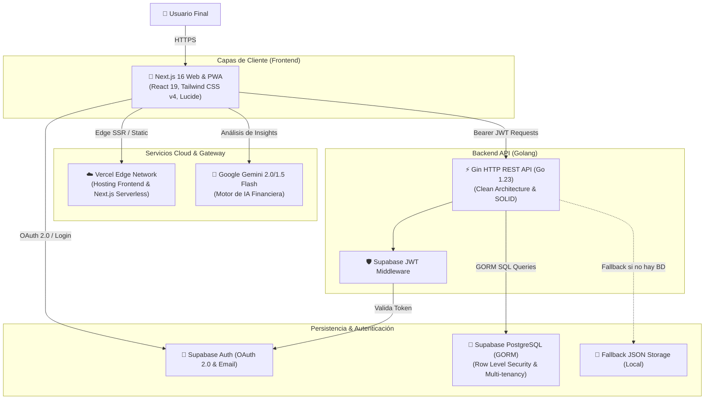

# 🏛️ Arquitectura del Sistema - FinTrack

FinTrack es una plataforma de finanzas personales diseñada con **Clean Architecture** en el backend y **Component-Driven Architecture** en el frontend, garantizando alto rendimiento, desacoplamiento modular, mantenibilidad y escalabilidad.

---

## 📐 1. Vista de Alto Nivel (C4 - Diagrama de Contenedores)



---

## 🧱 2. Backend Clean Architecture (Go)

El backend de FinTrack implementa rigurosamente el patrón de **Arquitectura Limpia (Clean Architecture)** dividido en 4 capas concéntricas con **Inversión de Dependencias**:

```
[ HTTP Request ]
       │
       ▼
┌────────────────────────────────────────────────────────┐
│  1. Handlers Layer (internal/handlers)                 │
│  - Deserialización de JSON y enlace de DTOs            │
│  - Extracción de Claims de contexto (userID)           │
│  - Retorno de Códigos de Estado HTTP y respuestas JSON │
└──────────────────────────┬─────────────────────────────┘
                           │ (Llama a interfaces de Servicio)
                           ▼
┌────────────────────────────────────────────────────────┐
│  2. Services Layer (internal/services)                 │
│  - Lógica de Dominio y Reglas Financieras              │
│  - Validaciones de negocio (nombres, categorías)       │
│  - Orquestación de reasignación de transacciones       │
│  - Aislamiento total de infraestructura HTTP           │
└──────────────────────────┬─────────────────────────────┘
                           │ (Llama a interfaces de Repositorio)
                           ▼
┌────────────────────────────────────────────────────────┐
│  3. Repositories Layer (internal/repository)           │
│  - Interfaces abstractas (Contratos)                   │
│  - Implementación GORM (PostgreSQL en Producción)      │
│  - Implementación Memory/JSON (Desarrollo / Offline)   │
└──────────────────────────┬─────────────────────────────┘
                           │
                           ▼
┌────────────────────────────────────────────────────────┐
│  4. Domain Models (internal/models)                    │
│  - Structs de datos: Expense, Income, Goal, Category   │
│  - Tags de base de datos (GORM) y serialización (JSON) │
└────────────────────────────────────────────────────────┘
```

### Estructura de Paquetes en `backend/`:
```
backend/
├── cmd/
│   └── api/                # Bootstrap de la aplicación
├── internal/
│   ├── database/           # Configuración de pool y migraciones GORM
│   ├── handlers/           # Controladores HTTP (Gin Framework)
│   ├── middleware/         # Autenticación JWT y CORS
│   ├── models/             # Entidades del dominio
│   ├── repository/         # Interfaces de persistencia
│   │   ├── gorm_repo/      # Implementación con PostgreSQL
│   │   └── memory_repo/    # Implementación con archivos JSON locales
│   └── services/           # Reglas de negocio puras
└── main.go                 # Inyector de dependencias principal
```

---

## 💻 3. Arquitectura del Frontend (Next.js 16 + React 19)

El frontend está estructurado para maximizar la modularidad, rendimiento web y accesibilidad:

```
frontend/src/
├── app/                    # App Router de Next.js
│   ├── api/ai/insights/    # Route handler serverless para Google Gemini
│   ├── expenses/           # Página de gestión de egresos
│   ├── incomes/            # Página de gestión de ingresos
│   ├── goals/              # Página de metas de ahorro
│   ├── layout.tsx          # Shell principal con Providers (Auth, Theme, Sound, i18n)
│   └── page.tsx            # Dashboard principal con métricas en tiempo real
├── components/             # Jerarquía de Componentes UI
│   ├── auth/               # AuthModal, Google OAuth button, Forgot Password
│   ├── categories/         # Modales y selectores de categorías dinámicas
│   ├── expenses/           # Formulario y listas de egresos
│   ├── incomes/            # Formulario y listas de ingresos
│   ├── goals/              # Barras de progreso y aportes a metas
│   ├── layout/             # Navbar, SubNavbar píldora, MobileDrawer
│   └── ui/                 # Primitivas accesibles basadas en Radix UI
├── contexts/               # Estado Global React (Auth, Currency, Language, Audio)
├── hooks/                  # Custom Hooks (useCategories, useSoundEffects)
├── lib/                    # Clientes de API, Supabase y utilitarios
└── types/                  # Definiciones de tipos TypeScript compartidas
```

---

## 🔒 4. Aislamiento Multi-Inquilino (Multi-Tenancy)

La seguridad de datos por usuario se garantiza en **todas las capas**:

1. **Cliente**: El frontend incluye el token Bearer emitido por Supabase en el encabezado `Authorization: Bearer <JWT>`.
2. **Middleware**: `backend/internal/middleware/auth.go` decodifica y verifica la firma del JWT, extrayendo el `userID` (UUID criptográfico) y guardándolo en el contexto de Gin.
3. **Servicio y Repositorio**: Cada consulta a la base de datos incluye obligatoriamente la cláusula de particionamiento:
   ```sql
   WHERE user_id = ?
   ```
4. **Base de Datos**: PostgreSQL cuenta con políticas **RLS (Row Level Security)** que impiden que cualquier usuario lea o modifique filas de otro usuario, incluso ante errores de código en capas superiores.
