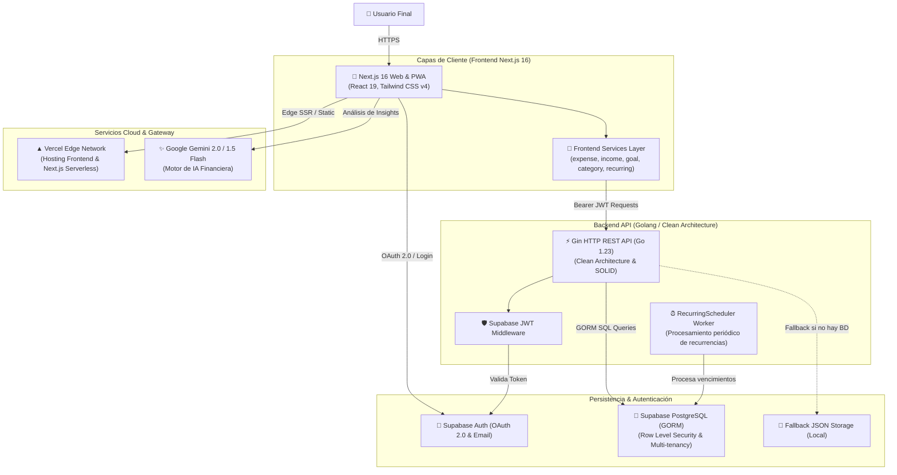
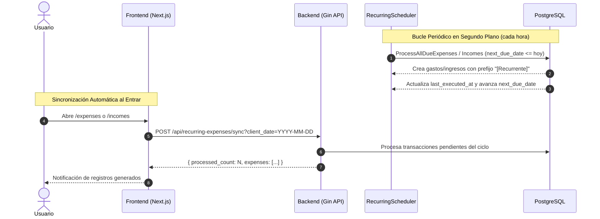
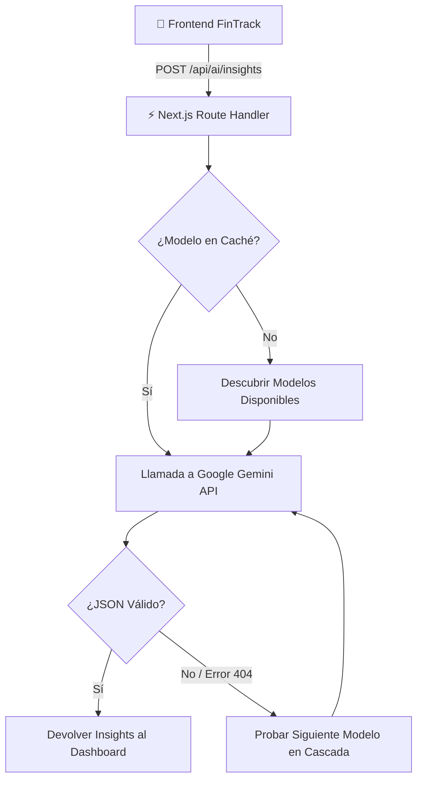

# 🏛️ Arquitectura del Sistema — FinTrack

FinTrack es una plataforma de finanzas personales diseñada bajo los paradigmas de **Clean Architecture** en el backend en **Go** y **Component-Driven & Service Layer Architecture** en el frontend en **Next.js 16**, garantizando alto rendimiento, desacoplamiento modular, mantenibilidad y escalabilidad.

---

## 🧭 1. Vista de Alto Nivel (C4 - Diagrama de Contenedores)



---

## 🧱 2. Backend Clean Architecture (Go)

El backend de FinTrack implementa el patrón de **Arquitectura Limpia (Clean Architecture)** dividido en capas concéntricas con **Inversión de Dependencias (DIP)**:

```
[ HTTP Request ]
       │
       ▼
┌────────────────────────────────────────────────────────┐
│  1. Handlers Layer (internal/handlers)                 │
│  - Deserialización de JSON y enlace de DTOs            │
│  - Extracción de Claims de contexto (userID)           │
│  - Retorno de Códigos de Estado HTTP y respuestas JSON │
└────────────────────────────────────────────────────────┘
                           │ (Llama a interfaces de Servicio)
                           ▼
┌────────────────────────────────────────────────────────┐
│  2. Services Layer (internal/services)                 │
│  - Lógica de Dominio y Reglas Financieras              │
│  - Validaciones de negocio (montos, categorías)        │
│  - Orquestación de transacciones y recurrencias        │
│  - RecurringScheduler (Background Worker)              │
│  - Aislamiento total de infraestructura HTTP           │
└────────────────────────────────────────────────────────┘
                           │ (Llama a interfaces de Repositorio)
                           ▼
┌────────────────────────────────────────────────────────┐
│  3. Repositories Layer (internal/repository)           │
│  - Interfaces abstractas / Contratos segregados        │
│  - Implementación GORM (PostgreSQL en Producción)      │
│  - Implementación Memory/JSON (Desarrollo / Offline)   │
└────────────────────────────────────────────────────────┘
                           │
                           ▼
┌────────────────────────────────────────────────────────┐
│  4. Domain Models (internal/models)                    │
│  - Structs de datos: Expense, Income, Goal, Category   │
│  - Structs de Recurrencia: RecurringExpense, Income    │
│  - Tags de base de datos (GORM) y serialización (JSON) │
└────────────────────────────────────────────────────────┘
```

### Estructura de Paquetes en `backend/`:
```
backend/
├── internal/
│   ├── database/               # Conexión PostgreSQL (GORM) y AutoMigrate
│   ├── handlers/               # Controladores HTTP (Gin Framework)
│   ├── middleware/             # Autenticación JWT y CORS
│   ├── models/                 # Entidades del dominio
│   ├── repository/             # Interfaces abstractas de persistencia
│   │   ├── gorm_repo/          # Implementación con PostgreSQL
│   │   └── memory_repo/        # Implementación con archivos JSON locales
│   └── services/               # Reglas de negocio puras, tests y Scheduler
│       ├── interfaces.go       # Contratos centralizados de servicios
│       ├── scheduler.go        # RecurringScheduler background worker
│       ├── expense_service.go
│       ├── income_service.go
│       ├── goal_service.go
│       ├── category_service.go
│       ├── recurring_expense_service.go
│       └── recurring_income_service.go
├── main.go                     # Bootstrap e Inyección de Dependencias
└── go.mod
```

---

## 🎨 3. Arquitectura del Frontend (Next.js 16 + React 19)

El frontend está estructurado mediante una clara separación de capas para maximizar modularidad, rendimiento web y testabilidad:

```
frontend/src/
├── app/                    # App Router de Next.js
│   ├── api/ai/insights/    # Route handler serverless para Google Gemini
│   ├── expenses/           # Página de gestión de egresos
│   ├── incomes/            # Página de gestión de ingresos
│   ├── goals/              # Página de metas de ahorro
│   ├── reports/            # Generación y exportación de reportes PDF/Excel/CSV
│   ├── layout.tsx          # Shell principal con Providers
│   └── page.tsx            # Dashboard principal con métricas en tiempo real
├── components/             # Jerarquía de Componentes UI
│   ├── auth/               # AuthModal, Google OAuth button, Forgot Password
│   ├── categories/         # Modales y selectores de categorías dinámicas
│   ├── expenses/           # Formulario, detalles y gestores de egresos
│   ├── incomes/            # Formulario, detalles y gestores de ingresos
│   ├── goals/              # Tarjetas de progreso y aportes a metas
│   ├── layout/             # Header, BottomNavbar, SettingsDrawer
│   └── ui/                 # Primitivas accesibles
├── contexts/               # Estado Global React (Auth, Currency, Language, Audio)
├── hooks/                  # Custom Hooks (useCategories, useSoundEffects)
├── services/               # Capa de Servicios desacoplada (SRP / DIP)
│   ├── expenseService.ts   # Operaciones de gastos
│   ├── incomeService.ts    # Operaciones de ingresos
│   ├── goalService.ts      # Operaciones de metas
│   ├── categoryService.ts  # Operaciones de categorías
│   ├── recurringService.ts # Operaciones de recurrencias
│   └── index.ts            # Barrel file unificado
├── lib/                    # Clientes de API, Supabase, Excel y utilitarios
└── types/                  # Definiciones de tipos TypeScript compartidas
```

---

## 🔁 4. Flujo de Transacciones Recurrentes



---

## 🔒 5. Aislamiento Multi-Inquilino (Multi-Tenancy)

La seguridad de datos por usuario se garantiza en **todas las capas**:

1. **Cliente**: El frontend incluye el token Bearer emitido por Supabase en el encabezado `Authorization: Bearer <JWT>`.
2. **Middleware**: `backend/internal/middleware/auth.go` decodifica y verifica la firma del JWT, extrayendo el `userID` (UUID criptográfico) y guardándolo en el contexto de Gin.
3. **Servicio y Repositorio**: Cada consulta a la base de datos incluye obligatoriamente la cláusula de particionamiento:
   ```sql
   WHERE user_id = ?
   ```
4. **Base de Datos**: PostgreSQL cuenta con políticas **RLS (Row Level Security)** que impiden que cualquier usuario lea o modifique filas de otro usuario, incluso ante eventuales errores de código en capas superiores.

---

## 🤖 6. Motor de Inteligencia Artificial (Google Gemini)

FinTrack integra un sistema de análisis predictivo y asesoría financiera personalizada impulsado por los modelos de lenguaje de última generación de **Google Gemini**.

### Arquitectura del Servicio de Insights
El análisis no sobrecarga el backend en Go; se ejecuta como una **Route Handler Serverless** en Next.js (`frontend/src/app/api/ai/insights/route.ts`), permitiendo ejecución escalable en el edge de Vercel.



### Cascada Resiliente de Modelos y Descubrimiento Dinámico
Para evitar caídas por modelos no disponibles o cambios en la API (`v1beta`), se implementan tres niveles de resiliencia:
1. **Descubrimiento Dinámico (`ModelService.ListModels`)**: Consulta automáticamente a Google qué modelos con soporte `generateContent` están activos para la clave de API suministrada.
2. **Lista de Respaldo Ordenada por Rendimiento**:
   ```typescript
   const fallbackList = [
     "gemini-2.0-flash",
     "gemini-1.5-flash-latest",
     "gemini-1.5-flash",
     "gemini-2.5-flash",
     "gemini-1.5-pro",
     "gemini-pro",
   ];
   ```
3. **Caché en Memoria (`cachedWorkingModel`)**: Una vez que un modelo responde con éxito, se almacena en memoria para que las consultas subsecuentes no pierdan tiempo en sondeos, reduciendo la latencia a menos de 1 segundo.

### Prompt Engineering y Salida Estructurada
El prompt instruye al modelo a comportarse como un asesor financiero certificado, exigiendo respuestas estrictamente en formato JSON:
```typescript
const prompt = `Actúa como un asesor financiero certificado y analiza estos datos financieros:
- Moneda activa: ${currency}
- Total Ingresos: ${totalIncome}
- Total Gastos: ${totalExpenses}
- Tasa de Ahorro: ${savingsRate}%
- Desglose por categorías y metas activas.

Genera de 3 a 5 recomendaciones accionables en formato JSON válido:
[
  {
    "id": "string",
    "type": "tip" | "warning" | "achievement" | "opportunity",
    "title": "string",
    "description": "string",
    "category": "string",
    "priority": "high" | "medium" | "low"
  }
]`;
```

### Sanitización y Fallback Heurístico Local
Si la cuota de la API de Google se agota o se pierde la conexión externa, el componente `FinancialInsights.tsx` activa un motor heurístico local que calcula alertas de presupuesto, tasa de ahorro y progreso de metas sin requerir conexión externa.

---

## 📜 7. Registro de Decisiones de Arquitectura (ADRs)

Las decisiones de diseño arquitectónico se documentan formalmente bajo el estándar ADR en [`docs/decisions/`](./decisions/):

| ADR | Título | Estado |
| :--- | :--- | :--- |
| [**ADR-001**](./decisions/ADR-001-clean-architecture-and-solid.md) | Adopción de Clean Architecture y Principios SOLID | Aceptado |
| [**ADR-002**](./decisions/ADR-002-dual-storage-gorm-and-memory.md) | Persistencia Híbrida Intercambiable (GORM PostgreSQL y JSON) | Aceptado |
| [**ADR-003**](./decisions/ADR-003-supabase-auth-and-multi-tenancy.md) | Autenticación con Supabase Auth y Seguridad Multi-Inquilino | Aceptado |
| [**ADR-004**](./decisions/ADR-004-frontend-service-layer-and-srp.md) | Capa de Servicios en el Frontend y Principio de Responsabilidad Única | Aceptado |
| [**ADR-005**](./decisions/ADR-005-recurring-scheduler-isolation.md) | Aislamiento del Scheduler Recurrente en el Backend (Go) | Aceptado |
