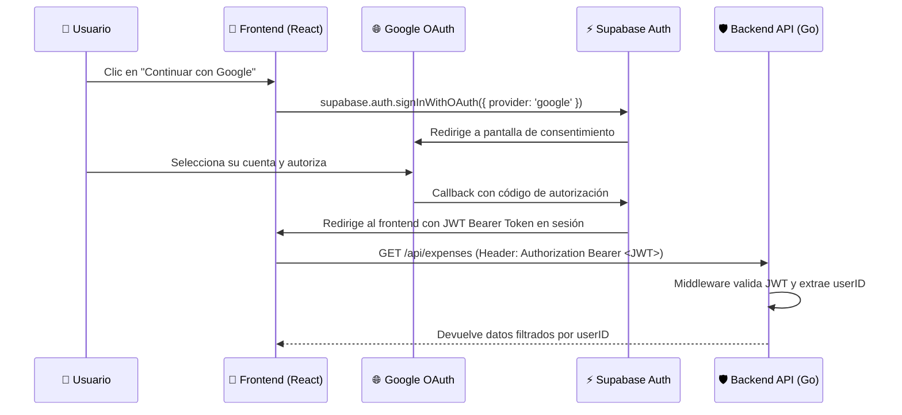
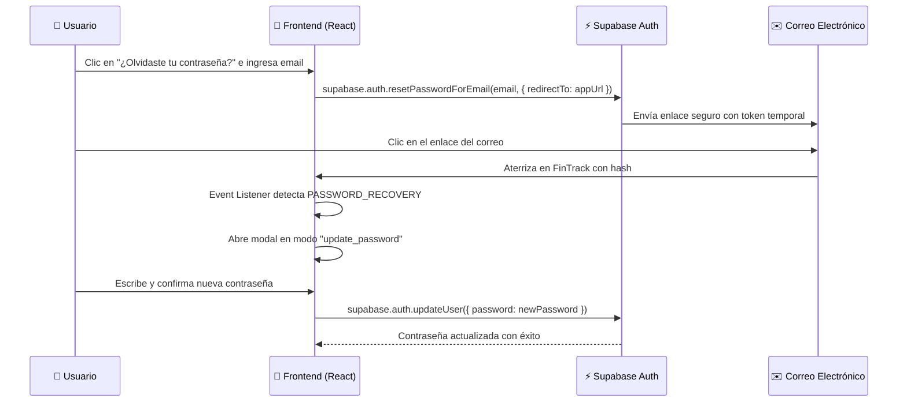

# 🔐 Autenticación y Seguridad — FinTrack

Este documento describe la arquitectura de autenticación, autorización y seguridad implementada en FinTrack.

---

## 🔑 1. Métodos de Autenticación

FinTrack soporta dos mecanismos de acceso mediante **Supabase Auth**:

1. **Email y Contraseña**:
   - Registro con confirmación de correo.
   - Hash seguro con bcrypt/Argon2 administrado por Supabase.
   - Flujo de restablecimiento de contraseña olvidada.
2. **Google OAuth 2.0**:
   - Inicio de sesión con un clic usando cuentas de Google.
   - No requiere gestión de contraseñas por parte del usuario.
   - Mapeo automático a un identificador único persistente (`sub` UUID).

---

## 🌐 2. Flujo de Autenticación OAuth 2.0 con Google



---

## 🔄 3. Flujo de Recuperación de Contraseña ("Olvidé mi contraseña")



---

## 🛡️ 4. Validación Criptográfica en el Backend Go

En el backend (`internal/middleware/auth.go`), cada petición entrante se intercepta y valida:

```go
// 1. Extracción del token del encabezado Authorization
authHeader := ctx.GetHeader("Authorization")
tokenString := strings.TrimPrefix(authHeader, "Bearer ")

// 2. Parseo y verificación de firma con SUPABASE_JWT_SECRET
token, err := jwt.Parse(tokenString, func(t *jwt.Token) (interface{}, error) {
    return []byte(jwtSecret), nil
})

// 3. Extracción del Subject ("sub") como userID del usuario
claims := token.Claims.(jwt.MapClaims)
userID := claims["sub"].(string)

// 4. Inyección en el contexto de Gin para que los controladores aíslen los datos
ctx.Set("userID", userID)
```

---

## 🚦 5. Políticas de CORS y Protección Web

El middleware `internal/middleware/cors.go` implementa:
* **Allowlist Dinámico**: Autoriza dominios de desarrollo (`http://localhost:3000`), ramas de preview en Vercel (`*.vercel.app`) y el dominio de producción especificado en `FRONTEND_URL`.
* **Protección contra Inyección SQL**: El 100% de las consultas a base de datos utilizan sentencias parametrizadas de GORM (`db.Where("user_id = ?", userID)`), neutralizando vectores de SQL Injection.
* **Encabezados Seguros**: Manejo estricto de `OPTIONS` preflight, `Access-Control-Allow-Credentials` y métodos permitidos (`GET, POST, PUT, DELETE`).
