# 🗄️ Esquema y Modelo de Datos - FinTrack

FinTrack utiliza **PostgreSQL** alojado en **Supabase** como su motor de base de datos relacional primario, operado mediante **GORM** en el backend de Go.

---

## 📊 1. Diagrama Entidad-Relación (ERD)

```mermaid
erDiagram
    USERS ||--o{ EXPENSES : "registra"
    USERS ||--o{ INCOMES : "recibe"
    USERS ||--o{ GOALS : "establece"
    USERS ||--o{ CATEGORIES : "personaliza"
    USERS ||--o{ RECURRING_EXPENSES : "programa"
    USERS ||--o{ RECURRING_INCOMES : "programa"

    USERS {
        uuid id PK "auth.users en Supabase"
        string email
        string raw_user_meta_data
    }

    RECURRING_EXPENSES {
        string id PK "rec-<UnixNano>"
        uuid user_id FK "Multi-tenancy"
        numeric amount "12,2 dígitos"
        varchar currency "USD, EUR, GBP, CRC"
        text description
        varchar category "Nombre de categoría"
        varchar payment_method "Forma de pago"
        varchar frequency "biweekly, monthly, etc."
        varchar biweekly_type "15_and_last_day, every_15_days"
        int billing_day "Día 1-31"
        timestamptz start_date "Inicio de vigencia"
        timestamptz next_due_date "Próximo vencimiento indexado"
        boolean is_active "Activo o pausado"
        boolean auto_register "Ejecución automática"
    }

    RECURRING_INCOMES {
        string id PK "rec-<UnixNano>"
        uuid user_id FK "Multi-tenancy"
        numeric amount "12,2 dígitos"
        varchar currency "USD, EUR, GBP, CRC"
        text description
        varchar source "Fuente de ingreso"
        varchar payment_method "Forma de cobro"
        varchar frequency "biweekly, monthly, etc."
        varchar biweekly_type "15_and_last_day, every_15_days"
        int billing_day "Día 1-31"
        timestamptz start_date "Inicio de vigencia"
        timestamptz next_due_date "Próximo cobro indexado"
        boolean is_active "Activo o pausado"
        boolean auto_register "Ejecución automática"
    }

    EXPENSES {
        string id PK "Timestamp UnixNano"
        uuid user_id FK "Multi-tenancy"
        numeric amount "12,2 dígitos"
        varchar currency "USD, EUR, GBP, CRC"
        text description
        varchar category "Nombre de la categoría"
        varchar payment_method "Efectivo, Tarjeta, etc."
        timestamptz date "Fecha del gasto"
        timestamptz created_at
    }

    INCOMES {
        string id PK "Timestamp UnixNano"
        uuid user_id FK "Multi-tenancy"
        numeric amount "12,2 dígitos"
        varchar currency "USD, EUR, GBP, CRC"
        text description
        varchar source "Fuente del ingreso"
        varchar payment_method "Transferencia, etc."
        timestamptz date "Fecha del ingreso"
        timestamptz created_at
    }

    GOALS {
        string id PK "Timestamp UnixNano"
        uuid user_id FK "Multi-tenancy"
        text name "Nombre de la meta"
        numeric target_amount "Monto objetivo"
        numeric current_amount "Monto ahorrado"
        timestamptz deadline "Fecha límite"
        varchar category "Categoría de la meta"
        timestamptz created_at
    }

    CATEGORIES {
        string id PK "cat-<UnixNano>"
        uuid user_id FK "Multi-tenancy"
        varchar name "Nombre único por usuario"
        varchar type "expense | income"
        varchar color "emerald, blue, amber, etc."
        varchar icon "Nombre de ícono Lucide"
        timestamptz created_at
    }
```



---

## 🛠️ 2. Estructura de Tablas SQL

### Tabla `expenses`
```sql
CREATE TABLE IF NOT EXISTS expenses (
    id VARCHAR(64) PRIMARY KEY,
    user_id UUID NOT NULL,
    amount NUMERIC(12, 2) NOT NULL,
    currency VARCHAR(10) DEFAULT 'USD',
    description TEXT NOT NULL,
    category VARCHAR(100) NOT NULL,
    payment_method VARCHAR(100) NOT NULL,
    date TIMESTAMPTZ NOT NULL,
    created_at TIMESTAMPTZ DEFAULT NOW()
);

CREATE INDEX IF NOT EXISTS idx_expenses_user_date ON expenses(user_id, date DESC);
CREATE INDEX IF NOT EXISTS idx_expenses_user_cat ON expenses(user_id, category);
```

### Tabla `incomes`
```sql
CREATE TABLE IF NOT EXISTS incomes (
    id VARCHAR(64) PRIMARY KEY,
    user_id UUID NOT NULL,
    amount NUMERIC(12, 2) NOT NULL,
    currency VARCHAR(10) DEFAULT 'USD',
    description TEXT NOT NULL,
    source VARCHAR(100) NOT NULL,
    payment_method VARCHAR(100) NOT NULL,
    date TIMESTAMPTZ NOT NULL,
    created_at TIMESTAMPTZ DEFAULT NOW()
);

CREATE INDEX IF NOT EXISTS idx_incomes_user_date ON incomes(user_id, date DESC);
```

### Tabla `goals`
```sql
CREATE TABLE IF NOT EXISTS goals (
    id VARCHAR(64) PRIMARY KEY,
    user_id UUID NOT NULL,
    name TEXT NOT NULL,
    target_amount NUMERIC(12, 2) NOT NULL,
    current_amount NUMERIC(12, 2) DEFAULT 0,
    deadline TIMESTAMPTZ NOT NULL,
    category VARCHAR(100) NOT NULL,
    created_at TIMESTAMPTZ DEFAULT NOW()
);

CREATE INDEX IF NOT EXISTS idx_goals_user ON goals(user_id, deadline ASC);
```

### Tabla `categories`
```sql
CREATE TABLE IF NOT EXISTS categories (
    id VARCHAR(64) PRIMARY KEY,
    user_id UUID NOT NULL,
    name VARCHAR(100) NOT NULL,
    type VARCHAR(20) NOT NULL DEFAULT 'expense',
    color VARCHAR(50) DEFAULT 'blue',
    icon VARCHAR(50) DEFAULT 'tag',
    created_at TIMESTAMPTZ DEFAULT NOW()
);

CREATE UNIQUE INDEX IF NOT EXISTS idx_categories_user_name_type 
ON categories(user_id, LOWER(name), type);
```

### Tabla `recurring_expenses` (Gastos Fijos y Recurrentes)
```sql
CREATE TABLE IF NOT EXISTS recurring_expenses (
    id VARCHAR(64) PRIMARY KEY,
    user_id UUID NOT NULL REFERENCES auth.users(id) ON DELETE CASCADE,
    description TEXT NOT NULL,
    amount NUMERIC(12, 2) NOT NULL CHECK (amount > 0),
    currency VARCHAR(10) NOT NULL DEFAULT 'USD',
    category VARCHAR(100) NOT NULL,
    payment_method VARCHAR(100) NOT NULL,
    frequency VARCHAR(20) NOT NULL DEFAULT 'biweekly',
    biweekly_type VARCHAR(30) DEFAULT '15_and_last_day',
    billing_day INT DEFAULT 15 CHECK (billing_day >= 1 AND billing_day <= 31),
    start_date TIMESTAMPTZ NOT NULL,
    end_date TIMESTAMPTZ,
    next_due_date TIMESTAMPTZ NOT NULL,
    last_executed_at TIMESTAMPTZ,
    is_active BOOLEAN NOT NULL DEFAULT TRUE,
    auto_register BOOLEAN NOT NULL DEFAULT TRUE,
    created_at TIMESTAMPTZ NOT NULL DEFAULT NOW(),
    updated_at TIMESTAMPTZ NOT NULL DEFAULT NOW()
);

CREATE INDEX IF NOT EXISTS idx_recurring_user_due 
ON recurring_expenses(user_id, next_due_date ASC);

CREATE INDEX IF NOT EXISTS idx_recurring_active_due 
ON recurring_expenses(is_active, auto_register, next_due_date ASC);

CREATE INDEX IF NOT EXISTS idx_recurring_user_category 
ON recurring_expenses(user_id, category);
```

### Tabla `recurring_incomes` (Ingresos Fijos y Recurrentes)
```sql
CREATE TABLE IF NOT EXISTS recurring_incomes (
    id VARCHAR(64) PRIMARY KEY,
    user_id UUID NOT NULL REFERENCES auth.users(id) ON DELETE CASCADE,
    description TEXT NOT NULL,
    amount NUMERIC(12, 2) NOT NULL CHECK (amount > 0),
    currency VARCHAR(10) NOT NULL DEFAULT 'USD',
    source VARCHAR(100) NOT NULL,
    payment_method VARCHAR(100) NOT NULL,
    frequency VARCHAR(20) NOT NULL DEFAULT 'biweekly' 
        CHECK (frequency IN ('weekly', 'biweekly', 'monthly', 'yearly')),
    biweekly_type VARCHAR(30) DEFAULT '15_and_last_day' 
        CHECK (biweekly_type IS NULL OR biweekly_type IN ('15_and_last_day', 'every_15_days')),
    billing_day INT DEFAULT 15 
        CHECK (billing_day IS NULL OR (billing_day >= 1 AND billing_day <= 31)),
    start_date TIMESTAMPTZ NOT NULL,
    end_date TIMESTAMPTZ,
    next_due_date TIMESTAMPTZ NOT NULL,
    last_executed_at TIMESTAMPTZ,
    is_active BOOLEAN NOT NULL DEFAULT TRUE,
    auto_register BOOLEAN NOT NULL DEFAULT TRUE,
    created_at TIMESTAMPTZ NOT NULL DEFAULT NOW(),
    updated_at TIMESTAMPTZ NOT NULL DEFAULT NOW(),
    CONSTRAINT chk_recurring_incomes_dates CHECK (end_date IS NULL OR end_date >= start_date)
);

CREATE INDEX IF NOT EXISTS idx_recurring_incomes_user_due 
ON recurring_incomes(user_id, next_due_date ASC);

CREATE INDEX IF NOT EXISTS idx_recurring_incomes_active_due 
ON recurring_incomes(is_active, auto_register, next_due_date ASC);

CREATE INDEX IF NOT EXISTS idx_recurring_incomes_user_source 
ON recurring_incomes(user_id, source);

CREATE INDEX IF NOT EXISTS idx_recurring_incomes_user_id 
ON recurring_incomes(user_id);
```

---

## 🛡️ 3. Políticas de Seguridad a Nivel de Fila (RLS)

Para garantizar la privacidad estricta de cada usuario en PostgreSQL, se aplican las siguientes políticas en Supabase:

```sql
-- Activar Row Level Security
ALTER TABLE expenses ENABLE ROW LEVEL SECURITY;
ALTER TABLE incomes ENABLE ROW LEVEL SECURITY;
ALTER TABLE goals ENABLE ROW LEVEL SECURITY;
ALTER TABLE categories ENABLE ROW LEVEL SECURITY;
ALTER TABLE recurring_expenses ENABLE ROW LEVEL SECURITY;
ALTER TABLE recurring_incomes ENABLE ROW LEVEL SECURITY;

-- Política de aislamiento para gastos
CREATE POLICY "Users can only access their own expenses" 
ON expenses FOR ALL 
USING (auth.uid() = user_id)
WITH CHECK (auth.uid() = user_id);

-- Política de aislamiento para ingresos
CREATE POLICY "Users can only access their own incomes" 
ON incomes FOR ALL 
USING (auth.uid() = user_id)
WITH CHECK (auth.uid() = user_id);

-- Política de aislamiento para metas
CREATE POLICY "Users can only access their own goals" 
ON goals FOR ALL 
USING (auth.uid() = user_id)
WITH CHECK (auth.uid() = user_id);

-- Política de aislamiento para categorías
CREATE POLICY "Users can only access their own categories" 
ON categories FOR ALL 
USING (auth.uid() = user_id)
WITH CHECK (auth.uid() = user_id);

-- Política de aislamiento para gastos fijos y recurrentes
CREATE POLICY "Users can only access their own recurring expenses" 
ON recurring_expenses FOR ALL 
USING (auth.uid() = user_id)
WITH CHECK (auth.uid() = user_id);

-- Política de aislamiento para ingresos fijos y recurrentes
CREATE POLICY "Users can only access their own recurring incomes" 
ON recurring_incomes FOR ALL 
USING (auth.uid() = user_id)
WITH CHECK (auth.uid() = user_id);
```

