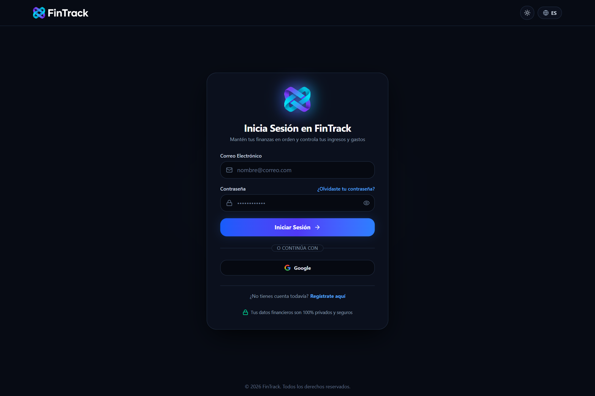
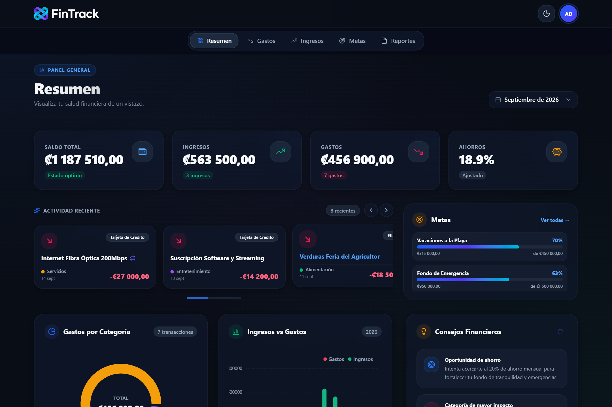
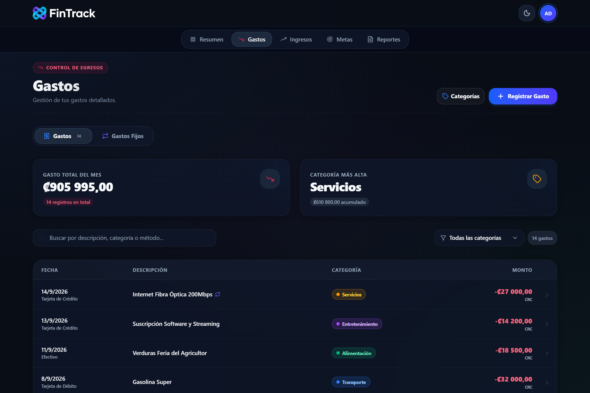
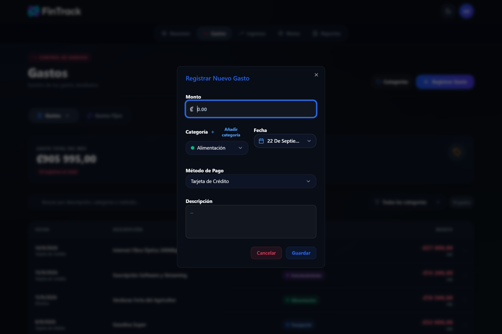
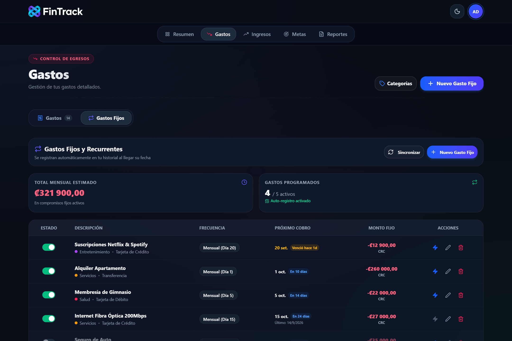
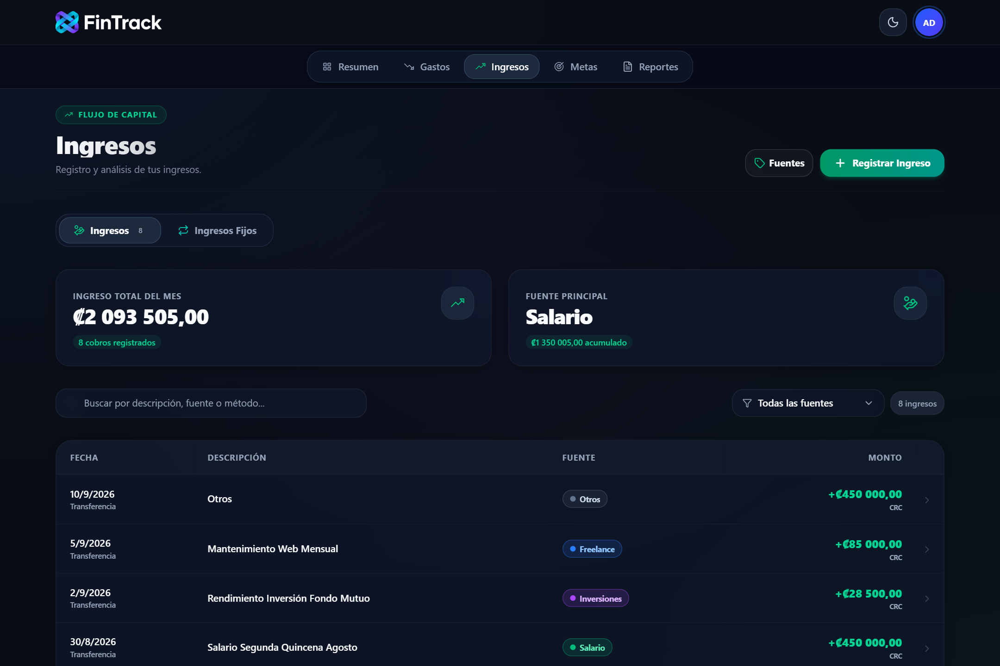
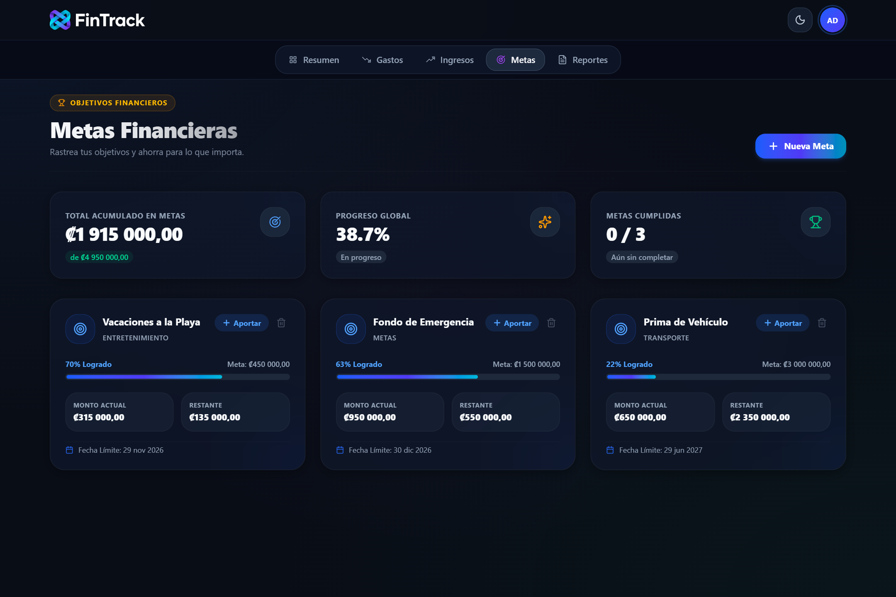
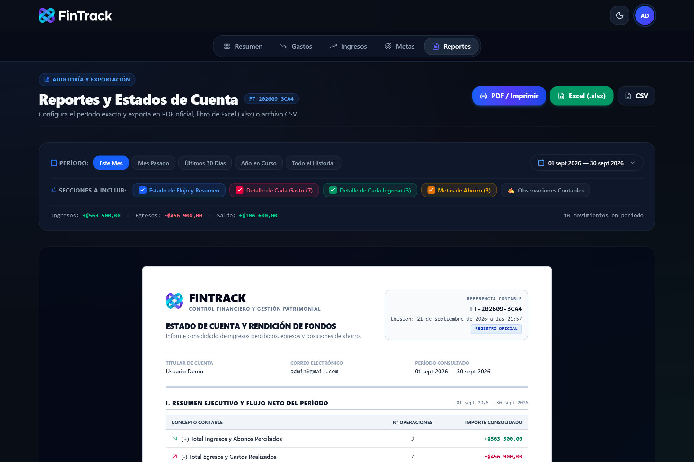
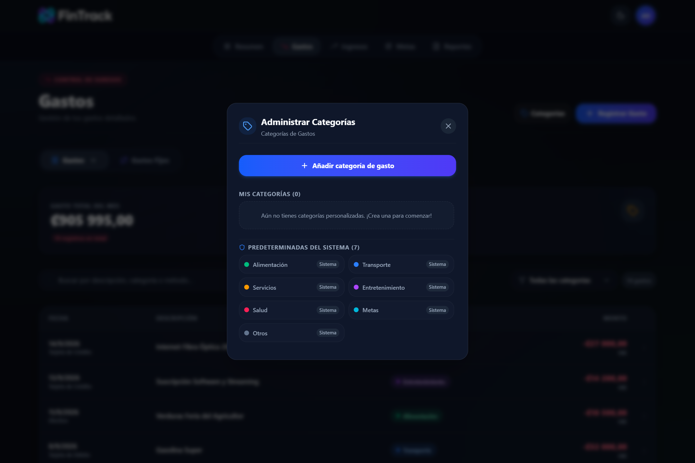

# 📘 Manual de Usuario Exhaustivo — FinTrack Web

Bienvenido al **Manual Oficial de Usuario de FinTrack**, tu plataforma integral de control financiero personal, contabilidad simplificada y seguimiento de metas patrimoniales.

Este manual ha sido elaborado para guiarte en el uso de cada una de las herramientas, pantallas, cálculos y configuraciones del sistema, complementado con **capturas de pantalla reales** de la aplicación en producción.

---

## 📑 Índice de Contenidos

1. [Arquitectura General y Seguridad](#1-arquitectura-general-y-seguridad)
   - [Seguridad de Acceso y Sesión](#seguridad-de-acceso-y-sesión)
   - [Inicio de Sesión y Creación de Cuenta](#inicio-de-sesión-y-creación-de-cuenta)
   - [Credenciales de Demostración](#credenciales-de-demostración)
2. [Entorno de Navegación y Preferencias](#2-entorno-de-navegación-y-preferencias)
   - [Barra de Navegación Superior e Inferior Móvil](#barra-de-navegación-superior-e-inferior-móvil)
   - [Selector de Moneda Internacional](#selector-de-moneda-internacional)
   - [Modo Oscuro / Modo Claro](#modo-oscuro--modo-claro)
   - [Instalación como PWA (Móvil y Escritorio)](#instalación-como-pwa-móvil-y-escritorio)
3. [Panel de Control Principal (Dashboard / Resumen)](#3-panel-de-control-principal-dashboard--resumen)
   - [Filtro Temporal del Dashboard](#filtro-temporal-del-dashboard)
   - [Tarjetas de Indicadores Clave (KPIs)](#tarjetas-de-indicadores-clave-kpis)
   - [Gráfico Dinámico de Gastos por Categoría](#gráfico-dinámico-de-gastos-por-categoría)
   - [Comparador Anual de Ingresos vs. Gastos](#comparador-anual-de-ingresos-vs-gastos)
   - [Carrusel Interactivo de Actividad Reciente](#carrusel-interactivo-de-actividad-reciente)
   - [Mini-Monitor de Metas y Consejos Financieros](#mini-monitor-de-metas-y-consejos-financieros)
4. [Gestión Completa de Gastos (Egresos)](#4-gestión-completa-de-gastos-egresos)
   - [Visualización y Consulta del Historial](#visualización-y-consulta-del-historial)
   - [Registro Paso a Paso de un Nuevo Gasto](#registro-paso-a-paso-de-un-nuevo-gasto)
   - [Filtros, Búsquedas y Métodos de Pago](#filtros-búsquedas-y-métodos-de-pago)
   - [Edición y Eliminación Segura](#edición-y-eliminación-segura)
5. [Gastos Fijos y Suscripciones Recurrentes](#5-gastos-fijos-y-suscripciones-recurrentes)
   - [Diferencia entre Gasto Ocasional y Gasto Fijo](#diferencia-entre-gasto-ocasional-y-gasto-fijo)
   - [Frecuencias Admitidas y Lógica de Quincenas](#frecuencias-admitidas-y-lógica-de-quincenas)
   - [Cálculo del Impacto Mensual y Proyección](#cálculo-del-impacto-mensual-y-proyección)
6. [Gestión Completa de Ingresos](#6-gestión-completa-de-ingresos)
   - [Registro de Salarios, Honorarios y Ventas](#registro-de-salarios-honorarios-y-ventas)
   - [Ingresos Fijos vs. Ingresos Variables](#ingresos-fijos-vs-ingresos-variables)
   - [Filtrado y Trazabilidad de Entradas](#filtrado-y-trazabilidad-de-entradas)
7. [Metas Financieras y Proyectos de Ahorro](#7-metas-financieras-y-proyectos-de-ahorro)
   - [Definición de Objetivos y Plazos](#definición-de-objetivos-y-plazos)
   - [Cómo Aportar Dinero a una Meta](#cómo-aportar-dinero-a-una-meta)
   - [Impacto del Aporte en el Flujo de Caja](#impacto-del-aporte-en-el-flujo-de-caja)
   - [Liquidación o Retiro de Fondos](#liquidación-o-retiro-de-fondos)
8. [Auditoría, Reportes y Exportación Contable](#8-auditoría-reportes-y-exportación-contable)
   - [Generación del Estado de Cuenta Oficial](#generación-del-estado-de-cuenta-oficial)
   - [Selección de Módulos a Incluir](#selección-de-módulos-a-incluir)
   - [Exportación a PDF Profesional con Código de Referencia](#exportación-a-pdf-profesional-con-código-de-referencia)
   - [Descarga en Excel (.xlsx) y CSV](#descarga-en-excel-xlsx-y-csv)
9. [Administración del Catálogo de Categorías](#9-administración-del-catálogo-de-categorías)
   - [Creación de Categorías con Paleta Cromática Personalizada](#creación-de-categorías-con-paleta-cromática-personalizada)
   - [Persistencia de Colores en Tablas y Gráficos](#persistencia-de-colores-en-tablas-y-gráficos)
   - [Eliminación de Categorías y Reasignación Automática](#eliminación-de-categorías-y-reasignación-automática)
10. [Preguntas Frecuentes y Diagnóstico de Problemas](#10-preguntas-frecuentes-y-diagnóstico-de-problemas)

---

## 1. Arquitectura General y Seguridad

### Seguridad de Acceso y Sesión
FinTrack utiliza un esquema de autenticación basado en **JSON Web Tokens (JWT)** con cifrado en capa de transporte (**HTTPS/TLS**) y almacenamiento en base de datos PostgreSQL en Supabase.

### Inicio de Sesión y Creación de Cuenta

#### Para Iniciar Sesión:
1. Accede a `https://fintrack-six-opal.vercel.app/login`.
2. Ingresa tu **Correo electrónico** registrado.
3. Ingresa tu **Contraseña**.
4. Pulsa el botón **Iniciar Sesión**. Los mensajes de error o advertencia solo se mostrarán en caso de datos incorrectos, garantizando una experiencia limpia.

#### Para Registrarte por Primera Vez:
1. En la pantalla de login, haz clic en la pestaña o enlace **Registrarse**.
2. Proporciona una cuenta de correo electrónico válida.
3. Define tu clave personal (longitud recomendada: mínimo 6 caracteres).
4. Confirma el registro. El sistema creará tu entorno privado y tus 7 categorías base predeterminadas.

### Credenciales de Demostración
Para fines de capacitación, auditoría o evaluación sin ingresar datos bancarios reales:
* **Correo**: `admin@gmail.com`
* **Contraseña**: `admin`

> [!NOTE]
> Esta cuenta demo cuenta con registros de sueldos, servicios, tarjetas, metas activas y gastos fijos precargados para explorar todas las capacidades de la plataforma.

---

## 2. Entorno de Navegación y Preferencias

### Barra de Navegación Superior e Inferior Móvil
FinTrack implementa un diseño responsivo adaptado según el dispositivo:
* **En Computadoras y Laptops**: En la parte superior encontrarás el selector central de pestañas: `Resumen`, `Gastos`, `Ingresos`, `Metas` y `Reportes`. A la derecha se ubica el conmutador de tema y el avatar de usuario con acceso rápido a cerrar sesión.
* **En Dispositivos Móviles (Smartphones)**: La interfaz traslada los accesos a una **barra de navegación inferior fija (Dock)** para facilitar la navegación con el pulgar, manteniendo el encabezado superior despejado.

### Selector de Moneda Internacional
La aplicación soporta tres denominaciones monetarias con recálculo visual en tiempo real:
* **Colones Costarricenses (`₡ CRC`)**: Configuración nativa por defecto.
* **Dólares Estadounidenses (`$ USD`)**.
* **Euros (`€ EUR`)**.

> [!TIP]
> Al cambiar de moneda, los símbolos y formatos numéricos se actualizan inmediatamente en tarjetas, tablas, modales y exportaciones sin recargar la página.

### Modo Oscuro / Modo Claro
FinTrack dispone de dos paletas de color integrales:
1. **Modo Oscuro (Dark Mode)**: Fondo `#0B0F19` con tarjetas `#111827` de alto contraste, ideal para evitar fatiga visual y reducir el consumo energético en pantallas OLED.
2. **Modo Claro (Light Mode)**: Fondos claros de alta legibilidad para ambientes iluminados o presentaciones.
* Para alternar, presiona el botón con el ícono de **Luna/Sol** situado en el extremo superior derecho.

### Instalación como PWA (Móvil y Escritorio)
FinTrack cumple con los estándares de *Progressive Web App*:
* **Google Chrome / Microsoft Edge (PC/Mac)**: Aparecerá un ícono de instalación a la derecha de la barra de direcciones URL. Haz clic en **Instalar FinTrack** para disponer de un acceso directo en tu escritorio e iniciarlo en ventana independiente sin barras de navegador.
* **Android**: Pulsa los 3 puntos del navegador Chrome y elige **Añadir a pantalla de inicio**.
* **iOS (iPhone/iPad)**: Pulsa el botón de **Compartir** en Safari y selecciona **Añadir a la pantalla de inicio**.

---

## 3. Panel de Control Principal (Dashboard / Resumen)

El **Resumen** es la central de mando donde se consolida tu salud patrimonial en tiempo real.

### Filtro Temporal del Dashboard
En la esquina superior derecha del Resumen se encuentra el **Selector de Período**:
* **Mes Actual** (ej. *Septiembre de 2026*): Filtra transacciones efectuadas dentro del mes en curso.
* **Meses Históricos**: Permite auditar el comportamiento de meses anteriores.
* **Todo el Histórico**: Muestra el acumulado total desde la creación de la cuenta.

### Tarjetas de Indicadores Clave (KPIs)
En la hilera principal se despliegan cuatro indicadores financieros esenciales:

| Indicador | Descripción y Cálculo | Estado Visual |
| :--- | :--- | :--- |
| **Saldo Total** | Balance neto del período: `Total Ingresos - Total Gastos`. | 🟢 *Estado óptimo* (saldo positivo) / 🔴 *Alerta* (saldo negativo). |
| **Ingresos** | Suma total de sueldos, rentas y cobros registrados en el mes, junto al conteo de operaciones. | 🟢 Conteo en verde con enlace directo al módulo. |
| **Gastos** | Suma total de compras, pagos de servicios y consumos del mes. | 🔴 Conteo en rojo con enlace directo al módulo. |
| **Ahorros (%)** | Tasa neta de ahorro: `((Ingresos - Gastos) / Ingresos) * 100`. | Muestra el estado: *Excelente* (≥ 20%), *Ajustado* (0-19%) o *Déficit*. |

### Gráfico Dinámico de Gastos por Categoría
* **Tipo**: Gráfico de anillo (*Doughnut Chart*).
* **Función**: Muestra la distribución porcentual del dinero gastado en el mes.
* **Colorimetría**: Cada segmento respeta el color asignado a la categoría.
* **Tooltip**: Al situar el cursor o pulsar sobre una rebanada, se revela el nombre, el monto exacto en tu moneda y el porcentaje relativo sobre el gasto total.

### Comparador Anual de Ingresos vs. Gastos
* **Tipo**: Gráfico de barras comparativas mensuales.
* **Función**: Permite evaluar mes a mes la relación entre dinero entrante (verde) y dinero saliente (rojo), facilitando la detección de meses con sobrecostos o estacionalidad financiera.

### Carrusel Interactivo de Actividad Reciente
Ubicado en el área central izquierda:
* Exhibe las **últimas 8 transacciones** registradas con fecha, descripción, categoría con su punto de color distintivo, método de pago y monto.
* Cuenta con botones de navegación lateral (`<` y `>`) y una barra de progreso suave.
* Hacer clic sobre cualquier tarjeta te traslada de inmediato al movimiento específico.

### Mini-Monitor de Metas y Consejos Financieros
* **Widget de Metas**: En el lateral derecho se listan las metas activas más cercanas con una barra de progreso porcentual (`% logrado`) y el balance actual contra la meta final.
* **Consejos Financieros**: Un motor de sugerencias contextuales analiza tu tasa de ahorro actual e identifica tu categoría de mayor consumo para advertirte proactivamente sobre posibles fugas de capital.

---

## 4. Gestión Completa de Gastos (Egresos)

El módulo de **Gastos** (`/expenses`) te permite llevar una contabilidad minuciosa de cada desembolso.

### Visualización y Consulta del Historial
La tabla central presenta:
1. **Fecha y Método**: Día de registro y medio de pago utilizado (Efectivo, Tarjeta de Crédito, Débito, Transferencia, etc.). Si el gasto proviene de una recurrencia fija, incluye un ícono distintivo de flechas cíclicas (`🔄`).
2. **Descripción**: Detalle conceptual de la compra o servicio.
3. **Categoría**: Etiqueta redondeada con el **color identificador** exacto de la categoría y un punto cromático.
4. **Monto**: Importe en rojo con el signo negativo (`-₡27 000,00`) formateado con separación de miles.

### Registro Paso a Paso de un Nuevo Gasto

Para registrar un gasto nuevo, presiona el botón azul **+ Registrar Gasto** en la esquina superior derecha:

#### Campos del Formulario:
1. **Monto**: Ingresa el valor numérico. El símbolo monetario se antepone de forma automática.
2. **Categoría**: Despliega la lista para elegir la categoría. Si requieres una no existente, puedes pulsar **Añadir categoría** directamente desde aquí.
3. **Fecha**: Selector con calendario interactivo para asignar compras pasadas o del día de hoy.
4. **Método de Pago**: Selecciona entre:
   - *Tarjeta de Crédito*
   - *Tarjeta de Débito*
   - *Efectivo*
   - *Transferencia Bancaria*
   - *Sinpe Móvil* (o billetera electrónica)
5. **Descripción**: Nota explicativa del gasto (ej. "Supermercado semanal", "Gasolina", "Farmacia").
6. Pulsa **Guardar**. El gasto se reflejará al instante en la tabla y los totales del mes.

### Filtros, Búsquedas y Métodos de Pago
* **Buscador de Texto en Vivo**: Escribe en la barra de búsqueda para filtrar al instante por descripción, comercio o método de pago.
* **Filtro por Categoría**: El selector desplegable permite aislar gastos de una única categoría (ej. solo *Alimentación* o solo *Servicios*) para analizar desembolsos específicos.

### Edición y Eliminación Segura
* **Editar**: Al hacer clic sobre cualquier fila del listado de gastos, se abre el modal precargado con sus datos para modificar importes, fechas o categorías.
* **Eliminar**: En el detalle del gasto encontrarás el botón rojo de papelera. Se solicitará confirmación antes de borrar el registro de la base de datos para prevenir pérdidas accidentales.

---

## 5. Gastos Fijos y Suscripciones Recurrentes

Dentro del módulo de Gastos, la pestaña superior **Gastos Fijos** permite gestionar compromisos recurrentes como alquileres, préstamos, colegiaturas, plataformas de streaming y servicios públicos.

### Diferencia entre Gasto Ocasional y Gasto Fijo
* **Gasto Ocasional**: Una transacción puntual (ej. una cena o una compra en la ferretería) que impacta una sola vez tu contabilidad.
* **Gasto Fijo**: Una obligación recurrente que FinTrack proyecta automáticamente para anticipar tus costos de vida fijos.

### Frecuencias Admitidas y Lógica de Quincenas
FinTrack soporta los siguientes esquemas de repetición:
* **Mensual**: Se cobra una vez por mes en el día indicado (ej. día 5 de cada mes).
* **Quincenal**: Diseñado específicamente para pagos vinculados a los ciclos quincenales (días 15 y fin de mes). 
  > [!IMPORTANT]
  > La aplicación aplica los gastos de quincena una vez que la fecha del sistema alcanza o supera el día de corte correspondiente, evitando que se carguen prematuramente si aún no se ha cumplido el ciclo.
* **Semanal / Bisemanal**: Repeticiones cada 7 o 14 días.
* **Anual**: Para seguros, pólizas o membresías de facturación anual.

### Cálculo del Impacto Mensual y Proyección
En el encabezado de la pestaña verás el **Total Mensual Estimado en Gastos Fijos**. Este indicador te dice cuánto dinero de tu salario ya está comprometido antes de comenzar a realizar consumos variables.

---

## 6. Gestión Completa de Ingresos

El módulo de **Ingresos** (`/incomes`) centraliza todas las entradas de capital a tus cuentas.

### Registro de Salarios, Honorarios y Ventas
1. Pulsa el botón **+ Registrar Ingreso**.
2. Completa los campos solicitados:
   - **Monto**: Importe neto percibido.
   - **Fuente o Categoría de Ingreso**: (ej. *Salario Quincenal*, *Trabajo Independiente*, *Rentas*, *Dividendos*, *Devoluciones*).
   - **Fecha**: Fecha efectiva de depósito.
   - **Método de Recepción**: Cuenta bancaria, efectivo, transferencia.
   - **Descripción**: Detalle del pagador o cliente.
3. Haz clic en **Guardar**.

### Ingresos Fijos vs. Ingresos Variables
Al igual que en los gastos, puedes conmutar entre **Ingresos** ordinarios e **Ingresos Fijos** para programar depósitos salariales recurrentes que se sumen automáticamente en cada ciclo contable.

### Filtrado y Trazabilidad de Entradas
La tabla de ingresos cuenta con su propio buscador rápido y totalizador mensual que expone el total de entradas y el número de depósitos verificados.

---

## 7. Metas Financieras y Proyectos de Ahorro

El módulo de **Metas** (`/goals`) te ayuda a planificar compras importantes, crear fondos de emergencia o reservar dinero para vacaciones sin mezclarlo con tu gasto corriente.

### Definición de Objetivos y Plazos
Para crear una nueva meta de ahorro:
1. Pulsa **+ Nueva Meta**.
2. Especifica:
   - **Nombre de la Meta**: (ej. *Fondo de Emergencia*, *Vacaciones a la Playa*, *Prima de Vehículo*).
   - **Monto Objetivo**: La cantidad total requerida.
   - **Monto Inicial**: Si ya tienes un dinero apartado para este fin, indícalo aquí (puede ser `0`).
   - **Fecha Límite (Opcional)**: Plazo estimado para completarla.
   - **Categoría Asociada**: Para categorizar la meta (ej. *Entretenimiento*, *Transporte*).
3. Haz clic en **Crear Meta**.

### Cómo Aportar Dinero a una Meta
Cada tarjeta de meta cuenta con un botón azul **+ Aportar**:
1. Haz clic en **+ Aportar** sobre la meta deseada.
2. Ingresa la suma que vas a abonar.
3. El sistema recalculará inmediatamente la barra de progreso, el porcentaje acumulado y el saldo restante.

### Impacto del Aporte en el Flujo de Caja
> [!NOTE]
> Cuando aportas dinero a una meta, FinTrack registra automáticamente el movimiento como una asignación financiera. Así, tu saldo disponible en el Dashboard refleja fielmente que ese dinero ha sido resguardado y no debe gastarse en consumos ordinarios.

### Liquidación o Retiro de Fondos
Si necesitas utilizar los fondos ahorrados o la meta ha alcanzado el 100%:
* Puedes liquidar la meta para transferir el dinero a tus fondos disponibles o marcarla como **Cumplida** (`3/3 metas cumplidas`).
* Si cancelas el objetivo, puedes optar por devolver el monto acumulado al saldo general.

---

## 8. Auditoría, Reportes y Exportación Contable

El módulo de **Reportes** (`/reports`) genera informes contables para control personal, solicitudes de crédito o declaraciones fiscales.

### Generación del Estado de Cuenta Oficial
La pantalla compone en tiempo real un documento formal con diseño membretado que incluye:
* **Identificador de Transacción Único** (ej. `FT-202609-3CA4`).
* **Datos del Titular**: Nombre y correo electrónico registrado.
* **Período Consultado**: Rango exacto de fechas analizadas.
* **Resumen Ejecutivo y Flujo Neto**: Cuadro comparativo de (+) Ingresos vs. (-) Egresos y Saldo Resultante.

### Selección de Módulos a Incluir
Mediante casillas interactivas puedes activar o desactivar qué secciones deseas incluir en el documento final:
* ☑️ **Estado de Flujo y Resumen**
* ☑️ **Detalle de Cada Gasto** (desglose línea por línea)
* ☑️ **Detalle de Cada Ingreso**
* ☑️ **Metas de Ahorro**
* ☑️ **Observaciones Contables**

### Exportación a PDF Profesional con Código de Referencia
* Al hacer clic en el botón azul **PDF / Imprimir**, se abrirá la vista de impresión optimizada del navegador.
* Puedes elegir **Guardar como PDF** en tamaño Carta o A4.
* La hoja de estilos oculta la barra de navegación web y adapta las tablas al formato impreso con membrete oficial.

### Descarga en Excel (.xlsx) y CSV
* **Botón Excel (.xlsx)**: Genera un libro de Microsoft Excel con fórmulas de sumatoria, encabezados estilizados y formato de celdas monetario.
* **Botón CSV**: Descarga un archivo en texto delimitado por comas, perfecto para importar en Google Sheets, Notion o programas contables externos.

---

## 9. Administración del Catálogo de Categorías

FinTrack te ofrece un sistema de categorización con soporte cromático para organizar tus egresos e ingresos.

### Creación de Categorías con Paleta Cromática Personalizada
1. En la pantalla de Gastos o Ingresos, haz clic en el botón **Categorías**.
2. Se desplegará el modal de **Administrar Categorías**.
3. Pulsa el botón **+ Añadir categoría de gasto** (o de ingreso).
4. Asigna un nombre claro (ej. *Mascotas*, *Gimnasio*, *Educación*).
5. Selecciona el color de tu preferencia de la paleta predefinida (verde esmeralda, azul zafiro, ámbar, violeta, carmín, cian, etc.).
6. Guarda la categoría. A partir de ese momento estará disponible en todos los selectores.

### Persistencia de Colores en Tablas y Gráficos
* Cada categoría conserva su color de manera estricta en:
  - Las etiquetas de la tabla de gastos e ingresos.
  - Los puntos indicadores en el carrusel de transacciones recientes.
  - Las rebanadas del gráfico circular del Dashboard.
  - Los resúmenes por categoría en la exportación de reportes.

### Eliminación de Categorías y Reasignación Automática
* **Categorías Predeterminadas**: Protegidas por el sistema con la etiqueta *Sistema* (Alimentación, Transporte, Servicios, Entretenimiento, Salud, Metas, Otros).
* **Categorías Propias**: Puedes eliminarlas cuando lo desees. Si una categoría eliminada contenía gastos asociados, el sistema reasignará automáticamente esos movimientos a la categoría comodín **Otros**, garantizando que tu historial y balances nunca se descuadren ni pierdan consistencia contable.

---

## 10. Preguntas Frecuentes y Diagnóstico de Problemas

### 1. ¿Por qué el toast o mensaje de notificación aparece arriba a la derecha?
Los avisos de confirmación (ej. *"Gasto registrado con éxito"*, *"Meta actualizada"*) se proyectan en la esquina superior derecha de la pantalla para garantizar alta visibilidad sin tapar los botones ni interferir con la navegación táctil en móviles.

### 2. ¿Qué ocurre con los gastos quincenales si estamos antes del día 15?
Los gastos configurados con periodicidad quincenal esperan a que la fecha del sistema alcance el día de corte (día 15 o fin de mes) para aplicarse, de forma que el saldo disponible no sufra deducciones anticipadas erróneas.

### 3. ¿El sistema funciona sin conexión a internet?
Al ser una aplicación web progresiva (PWA), la interfaz se almacena en la memoria caché de tu navegador. Sin embargo, para sincronizar nuevos gastos, autenticarte y calcular balances en la nube, se requiere conexión activa con el servidor de base de datos.

### 4. ¿Cómo cambio la contraseña de mi cuenta?
Dirígete a tu perfil haciendo clic en el avatar de la esquina superior derecha y selecciona la opción de seguridad para actualizar tus credenciales.

### 5. ¿Mis datos están respaldados?
Sí. Toda la información reside en una base de datos PostgreSQL alojada en centros de datos con copias de seguridad automatizadas diarias y conexiones encriptadas de extremo a extremo.

---

*Manual de Usuario de FinTrack — Versión 2.4 — Actualizado en Septiembre de 2026.*
